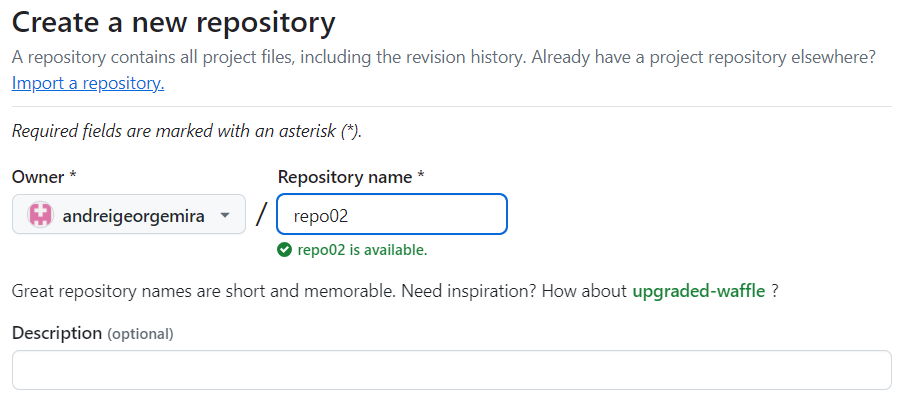
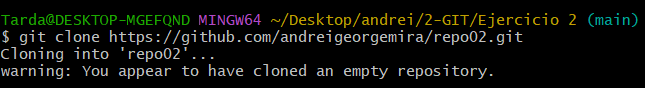
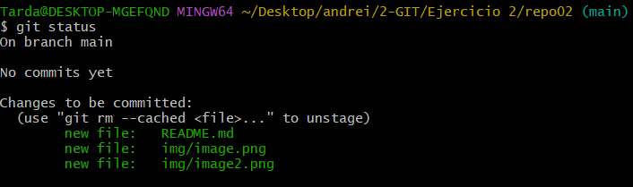
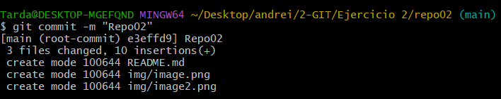
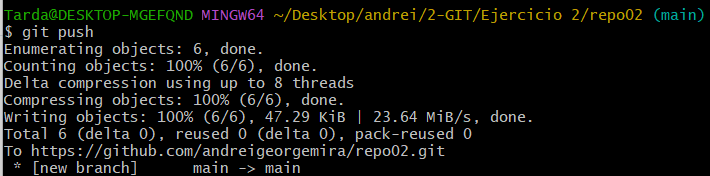
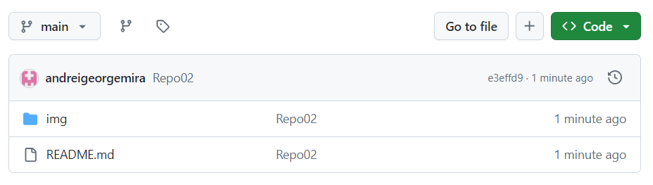

# Ejercicio 2

## 2.1
Al crearlo des de GitHub, se convierte en un repositorio remoto

## 2.2

## 2.3
El fichero README.md es en el que estas leyendo esto

Para poder hacer un commit, primero trackearemos los fichero con un **git add .** 

Haremos el commit de los fichero trackeaos

Procedemos a hacer el push

Comporbamos en GitHub que se ha subido nuestros cambios

## 2.4

Los principales comandos que hemos utilizado, han sido los siguentes:
- **git init** --> Marcar una carpeta como repositorio
- **git add .** --> trackear los fichero para pasarlos a staging area
- **git commit -m "Commit"** --> hacer un commit con un nombre de los fichero trackeados para que asi esten listos para subirse a la nube
- **git push (-u origin rama)**--> subir los fichero al repositorio remoto